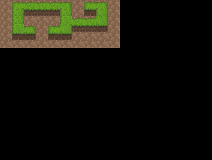

Main loop
=========

Initialization
--------------

In order to make use of that map of ours, we need to actually call the renderer code somewhere. It's time to create the heart of our game -- the main game loop.

First we need to initialize some globals that our game will be using, load the
map tiles and initialize PyGame's screen and clock. Then we draw out map on a separate surface for the background, and blit that to the screen, refreshing it afterwards with flip -- that refreshes the whole screen, we will later see how to only refresh the parts that changed::

    if __name__ == "__main__":
        screen = pygame.display.set_mode((424, 320))

        MAP_TILE_WIDTH = 24
        MAP_TILE_HEIGHT = 16
        MAP_CACHE = {
            'ground.png': load_tile_table('ground.png', MAP_TILE_WIDTH,
                                          MAP_TILE_HEIGHT),
        }

        level = Level()
        level.load_file('level.map')

        clock = pygame.time.Clock()
        
        background, overlay_dict = level.render()
        overlays = pygame.sprite.RenderUpdates()
        for (x, y), image in overlay_dict.iteritems():
            overlay = pygame.sprite.Sprite(overlays)
            overlay.image = image
            overlay.rect = image.get_rect().move(x * 24, y * 16 - 16)
        screen.blit(background, (0, 0))
        overlays.draw(screen)
        pygame.display.flip()

Main game loop
--------------

For now the game loop will just redraw the overlays 15 times per second, and react to any events: record keypresses and exit when you close the window::

    game_over = False
    while not game_over:

        # XXX draw all the objects here

        overlays.draw(screen)
        pygame.display.flip()
        clock.tick(15)
        for event in pygame.event.get():
            if event.type == pygame.locals.QUIT:
                game_over = True
            elif event.type == pygame.locals.KEYDOWN:
                pressed_key = event.key

We are doing 15 iterations of the loop per second, using pygame's clock. In each iteration we will draw our objects on the background, and then draw the overlays over them.

Later we will move the main loop into a separate "Game" object, and put some of the state we need to keep track of on it. For now it's enough.
 
Empty map
---------

By now you should have a program that you can run and that displays roughly something like this:

You can edit the "map.txt" file and see how it changes the map displayed. You can also change the tileset image, but remember to add it to the loading code.

Tile cache
----------

Actually, adding the loading to the initialization code every time you add a new tileset is kind of lame. We can do better than that: we will make a cache object that will act as a dict, but will automatically load any tilesets we request::

    class TileCache:
        """Load the tilesets lazily into global cache"""

        def __init__(self,  width=32, height=None):
            self.width = width
            self.height = height or width
            self.cache = {}

        def __getitem__(self, filename):
            """Return a table of tiles, load it from disk if needed."""

            key = (filename, self.width, self.height)
            try:
                return self.cache[key]
            except KeyError:
                tile_table = self._load_tile_table(filename, self.width,
                                                   self.height)
                self.cache[key] = tile_table
                return tile_table

        def _load_tile_table(self, filename, width, height):
            """Load an image and split it into tiles."""

            image = pygame.image.load(filename).convert()
            image_width, image_height = image.get_size()
            tile_table = []
            for tile_x in range(0, image_width/width):
                line = []
                tile_table.append(line)
                for tile_y in range(0, image_height/height):
                    rect = (tile_x*width, tile_y*height, width, height)
                    line.append(image.subsurface(rect))
            return tile_table

Now we can just do::

    MAP_CACHE = TileCache(MAP_TILE_WIDTH, MAP_TILE_HEIGHT)
	
