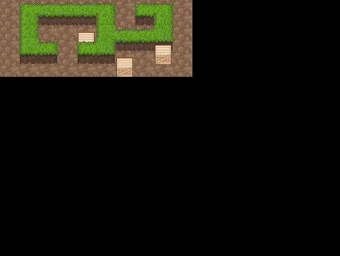
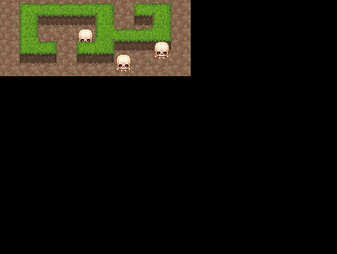

Sprites
=======

Immobile objects
----------------

Our map is kinda neat by now, but it's still a little bit empty. Before we populate it with the player character and monsters, lets just put some immobile crates in it. It should be easier, as they are not animated.

We will need to add it to our map:

.. code-block:: ini

    [level]
    tileset = ground.png
    map = ..........
          .#####.##.
          .#...#..#.
          .#..b####.
          .##.##..b.
          ......b...
    [.]
    name = floor
    tile = 0, 3

    [#]
    name = wall
    wall = true
    block = true

    [b]
    name = crate
    tile = 0, 3
    block = true
    sprite = crate.png

Now we need to modify our level loading code to use the "sprite" attribute::

    self.items = {}
    for y, line in enumerate(self.map):
        for x, c in enumerate(line):
            if not self.is_wall(x, y) and 'sprite' in self.key[c]:
                self.items[(x, y)] = self.key[c]
                    
Then we will load the sprite graphics into a separate cachem and keep a group of sprites for our level in our main loop. Our sprites will all be 32 by 32 pixels::

    level = Level()
    level.load_file('level.map')

    SPRITE_CACHE = TileCache(32, 32)
    sprites = pygame.sprite.RenderUpdates()
    for pos, tile in level.items.iteritems():
        sprite = Sprite(pos, SPRITE_CACHE[tile["sprite"]])
        sprites.add(sprite)

We still need to define our Sprite class. For now it will just use the very first frame as the image::

    class Sprite(pygame.sprite.Sprite):
        def __init__(self, pos=(0, 0), frames=None):
            super(Sprite, self).__init__()
            self.image = frames[0][0]
            self.rect = self.image.get_rect()
            self.pos = pos
            
        def _get_pos(self):
            """Check the current position of the sprite on the map."""

            return (self.rect.midbottom[0]-12)/24, (self.rect.midbottom[1]-16)/16

        def _set_pos(self, pos):
            """Set the position and depth of the sprite on the map."""

            self.rect.midbottom = pos[0]*24+12, pos[1]*16+16
            self.depth = self.rect.midbottom[1]

        pos = property(_get_pos, _set_pos)

        def move(self, dx, dy):
            """Change the position of the sprite on screen."""

            self.rect.move_ip(dx, dy)
            self.depth = self.rect.midbottom[1]

Finally, we can draw all those sprites in our main loop, just before we draw the overlays::

    sprites.clear(screen, background)
    dirty = sprites.draw(screen)
    overlays.draw(screen)
    pygame.display.update(dirty)
    clock.tick(15)

Note that instead using :func:`pygame.display.flip` we switched to :func:`pygame.display.update`, which takes a list of rectangles to update as a parameter. This way we are only updating the parts of the screen that contain sprites -- the only thing that can move.

Your program should now display something like this:

Animation
---------

That map is getting updated at 15 frames per minute, but we can't really see that because there is nothing moving. Lets fix that and add some animated monsters.

We actually already have almost all that we need -- just need to extend the Sprite class a little bit::

    class Sprite(pygame.sprite.Sprite):
        def __init__(self, pos=(0, 0), frames=None):
            super(Sprite, self).__init__()
            self.frames = frames
            self.animation = self.stand_animation()
            self.image = frames[0][0]
            self.rect = self.image.get_rect()
            self.pos = pos

        def stand_animation(self):
            while True:
                for frame in self.frames[0]:
                    self.image = frame
                    yield None
                    yield None

        def update(self, *args):
            self.animation.next()

We are using iterators for defining animations -- this way we don't need to keep track of the current frame and such -- we just iterate over the animation. The default animation just changes the frame to the next one every two ticks -- we need to change our crate sprites to "skeleton.png" to see the difference.

Lastly, we need to update the sprites between clearing and drawing them::

    sprites.clear(screen, background)
    sprites.update()
    dirty = sprites.draw(screen)

If everything went right, you should now see some animated skeletons:

