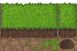
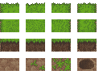

Tiles
=====

Just to make sure we are on the same page: if you ever played any RPG games for Game Boy, NES, SNES or some of the titles on Game Boy Advance or Nintendo DS, you have surely noticed that the display consists of a scrolled map, composed of square (or rectangular) elements, with animated characters, monsters and other objects added to it. This is what we are going to make. Usually games also have a more or less sophisticated system of menus for inventory and combat, and of course plot and dialogs a lot of finer details -- that's outside the scope of this article.

As was said, the map is composed of rectangular elements, fit together on a grid. Sometimes there are so many of them and they are so well drawn that you can hardly tell where one of them begins and other ends. We will be calling them "tiles", because they are arranged like tiles on a kitchen floor. Incidentally, they will sometimes be tiles of actual floor tiles, but also of grass, walls, ground, trees, etc. -- usually most non-moving things in those games are created using tiles. The graphics for those tiles is usually taken from tilesets. Tilestes are, well sets of tiles, usually in a form of images containing rows of tiles aligned one next to the other, one of each tile type. Our program will slice them into single tiles, and "stamp" those on the screen to create the map. An example of a small tileset may look like this:

To use that tileset, we will need some code that will load it into memory and slice into single tiles. We will use something like this::

    import pygame
    import pygame.locals

    def load_tile_table(filename, width, height):
        image = pygame.image.load(filename).convert()
        image_width, image_height = image.get_size()
        tile_table = []
        for tile_x in range(0, image_width/width):
            line = []
            tile_table.append(line)
            for tile_y in range(0, image_height/height):
                rect = (tile_x*width, tile_y*height, width, height)
                line.append(image.subsurface(rect))
        return tile_table

    if __name__=='__main__':
        pygame.init()
        screen = pygame.display.set_mode((128, 98))
        screen.fill((255, 255, 255))
        table = load_tile_table("ground.png", 24, 16)
        for x, row in enumerate(table):
            for y, tile in enumerate(row):
                screen.blit(tile, (x*32, y*24))
        pygame.display.flip()
        while pygame.event.wait().type != pygame.locals.QUIT:
            pass

The function :func:`load_tile_table` will load tiles from a tileset file, and return them sliced up as a list of lists. At first I did that by creating separate surfaces, but later I found out that using ``subsurface`` is better -- it doesn't create copies in memory. Once the tiles are loaded, they are displayed, a little spaced so that you can see where they end:

Map definition
--------------

We usually don't want to hardcode the maps in our game, so it's best to put them in a file. You might distract yourself by writing a map editor, or use an existing editor and merely distract yourself trying to figure out how to parse the files it produces. I took an easier route and just used a plain text file, parsed with the :mod:`ConfigParser`. I define the map as lines of characters, every character representing one map square. What exactly that square contains is defined later in the file, in sort of a legend. So, an example map definition may look like this (save it in a file "level.map"):

.. code-block:: ini

    [level]
    tileset = ground.png
    map = ..........
          .#####.##.
          .#...#..#.
          .#...####.
          .##.##....
          ..........

    [.]
    name = floor
    tile = 0, 3

    [#]
    name = wall
    wall = true
    block = true

This way, for every map square I have a dictionary of key-value pairs describing that square. If I need to add something, I just add a new character to the legend, with the description. Now, the parsing of that goes something like this::

    import ConfigParser

    class Level(object):
        def load_file(self, filename="level.map"):
            self.map = []
            self.key = {}
            parser = ConfigParser.ConfigParser()
            parser.read(filename)
            self.tileset = parser.get("level", "tileset")
            self.map = parser.get("level", "map").split("\n")
            for section in parser.sections():
                if len(section) == 1:
                    desc = dict(parser.items(section))
                    self.key[section] = desc
            self.width = len(self.map[0])
            self.height = len(self.map)

        def get_tile(self, x, y):
            try:
                char = self.map[y][x]
            except IndexError:
                return {}
            try:
                return self.key[char]
            except KeyError:
                return {}

With this code, you can just use :func:`get_tile` to get a dict of values for any particular map square. We will add a couple of convenience methods for accessing oten used values::

    class Level(object): # Continued...
        def get_tile(self, x, y):
            """Tell what's at the specified position of the map."""

            try:
                char = self.map[y][x]
            except IndexError:
                return {}
            try:
                return self.key[char]
            except KeyError:
                return {}

        def get_bool(self, x, y, name):
            """Tell if the specified flag is set for position on the map."""

            value = self.get_tile(x, y).get(name)
            return value in (True, 1, 'true', 'yes', 'True', 'Yes', '1', 'on', 'On')

        def is_wall(self, x, y):
            """Is there a wall?"""

            return self.get_bool(x, y, 'wall')

        def is_blocking(self, x, y):
            """Is this place blocking movement?"""

            if not 0 <= x < self.width or not 0 <= y < self.height:
                return True
            return self.get_bool(x, y, 'block')
	

Drawing the map 
---------------

Now we can just iterate over all map squares and draw appropriate tiles in the right places. This works fine for floor tiles and maybe some simple walls, but you might have noticed that we have a lot of different tiles for corners, straight walls, etc. You could of course use different characters for them in your map definition, but making them match manually is pretty boring and can be easily automated. Se we have a flag "wall" for our map squares, and when that flag is set we choose the right tile by looking at the neighboring squares. The code is not very pretty, but it does what we want. Oh, I forgot, we don't draw our map directly on the screen, we draw it on a separate "background" surface, and we only do it once per map. Then we can draw that surface on the screen, draw some more elements on top and still be able to erase those elements, by drawing parts from the background over them. We might also make the background larger than the screen and implement scrolling, although I won't cover that here.

This is enough if we have a "flat" map, for example only different kinds of terrain. But there is a problem if we want walls. Walls should obscure the view and so we need to draw parts of them on top of anything we add to the map. We will do it by keeping a dict of all the elements that need to be drawn on top, called overlays. Our finished map-drawing code may look like this::

    class Level(object): # Continued...

        def is_wall(self, x, y):
            return self.get_bool(x, y, 'wall')

        def render(self):
            wall = self.is_wall
            tiles = MAP_CACHE[self.tileset]
            image = pygame.Surface((self.width*MAP_TILE_WIDTH, self.height*MAP_TILE_HEIGHT))
            overlays = {}
            for map_y, line in enumerate(self.map):
                for map_x, c in enumerate(line):
                    if wall(map_x, map_y):
                        # Draw different tiles depending on neighbourhood
                        if not wall(map_x, map_y+1):
                            if wall(map_x+1, map_y) and wall(map_x-1, map_y):
                                tile = 1, 2
                            elif wall(map_x+1, map_y):
                                tile = 0, 2
                            elif wall(map_x-1, map_y):
                                tile = 2, 2
                            else:
                                tile = 3, 2
                        else:
                            if wall(map_x+1, map_y+1) and wall(map_x-1, map_y+1):
                                tile = 1, 1
                            elif wall(map_x+1, map_y+1):
                                tile = 0, 1
                            elif wall(map_x-1, map_y+1):
                                tile = 2, 1
                            else:
                                tile = 3, 1
                        # Add overlays if the wall may be obscuring something
                        if not wall(map_x, map_y-1):
                            if wall(map_x+1, map_y) and wall(map_x-1, map_y):
                                over = 1, 0
                            elif wall(map_x+1, map_y):
                                over = 0, 0
                            elif wall(map_x-1, map_y):
                                over = 2, 0
                            else:
                                over = 3, 0
                            overlays[(map_x, map_y)] = tiles[over[0]][over[1]]
                    else:
                        try:
                            tile = self.key[c]['tile'].split(',')
                            tile = int(tile[0]), int(tile[1])
                        except (ValueError, KeyError):
                            # Default to ground tile
                            tile = 0, 3
                    tile_image = tiles[tile[0]][tile[1]]
                    image.blit(tile_image,
                               (map_x*MAP_TILE_WIDTH, map_y*MAP_TILE_HEIGHT))
            return image, overlays

Then we can draw the background image on the screen, followed by all the movable objects and sprites, and then draw the overlays on top of them. We will keep them as a sprite group for convenience.

